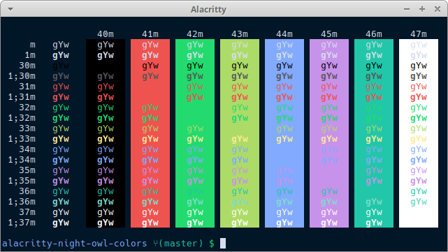

# alacritty-night-owl-colors

DEPRECATED: Theme is now available at: https://github.com/alacritty/alacritty/wiki/Color-schemes

A port of Sarah Drasner's [Night Owl VS Code theme](https://github.com/sdras/night-owl-vscode-theme) for Alacritty



## Instructions

Just replace the `colors` tree with the following on your `alacritty.yml`:

```yaml
# Colors (Night Owl by Sarah Drasner)
colors:
  # Default colors
  primary:
    background: '0x011627'
    foreground: '0xd6deeb'

  # Colors the cursor will use if `custom_cursor_colors` is true
  cursor:
    text: '0xffffff'
    cursor: '0x7e57c2'

  # Normal colors
  normal:
    black:   '0x000000'
    red:     '0xef5350'
    green:   '0x22da6e'
    yellow:  '0xaddb67'
    blue:    '0x82aaff'
    magenta: '0xc792ea'
    cyan:    '0x21c7a8'
    white:   '0xffffff'

  # Bright colors
  bright:
    black:   '0x575656'
    red:     '0xef5350'
    green:   '0x22da6e'
    yellow:  '0xffeb95'
    blue:    '0x82aaff'
    magenta: '0xc792ea'
    cyan:    '0x7fdbca'
    white:   '0xffffff'
```

Test script obtained from: https://pastebin.com/LPtpFFub
